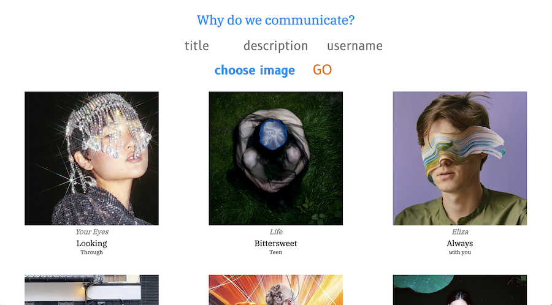
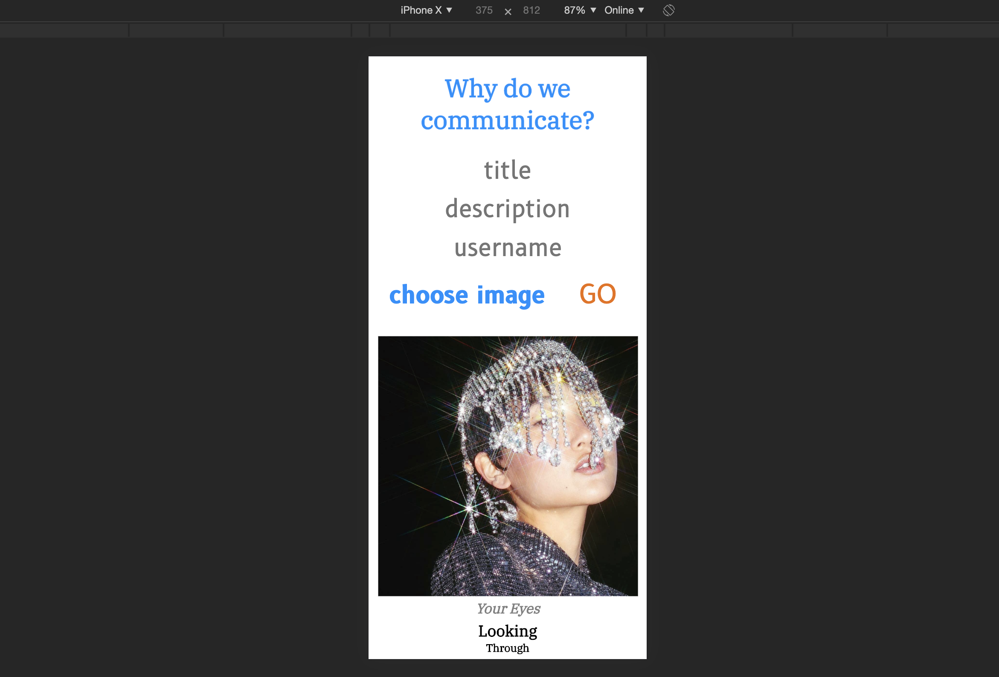

# Image-board

This site is a plain Instagram-inspired image-board to upload pictures and write comments with a username. I named it "Why do we communicate?", to show that inner feelings can be expressed by photos and visually communicated. We are communicating all time by using such apps as Instagram.

# Tech Stack

It's a single-page framework application made with:

* HTML, CSS/RWD, Javascript, Vue.js, Node.js, Express, AWS/S3, Multer, PostgreSQL

       Including a database with two tables:
              - Uploading images with title, description and username
              - Posting comments with username

## Demo image-board

The project was made in one week during my training at SPICED Academy Berlin. They provided me with a package.json.

## Uploading image

## Posting comment

By clicking on an image it opens in bigger as an overlay and users can write comments.

Images taken from Instagram accounts such as Cottweiler, Fashion For Bank Robbers, Craig Green, Kikokostadinov, Ren Hang, Walter Van Beirendonck, combined with images of a photo series that I made in collaboration with the photographer Eva Baramsky.

## Mobile responsive

Images drop in a vertical line in responsive version.

